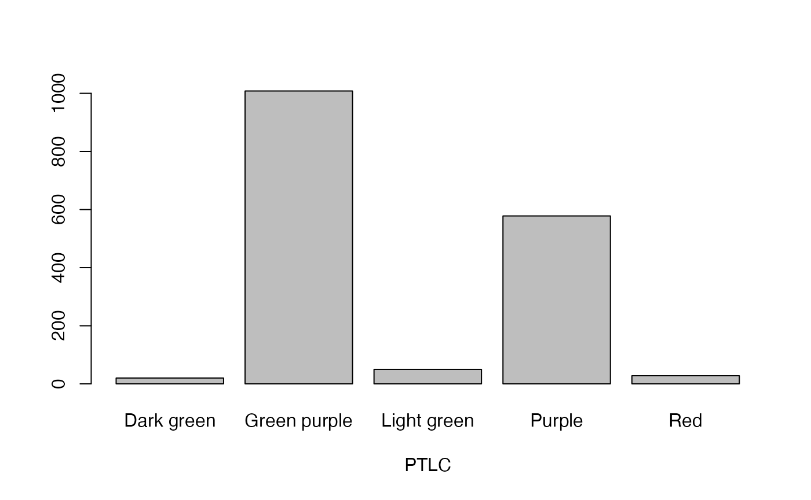
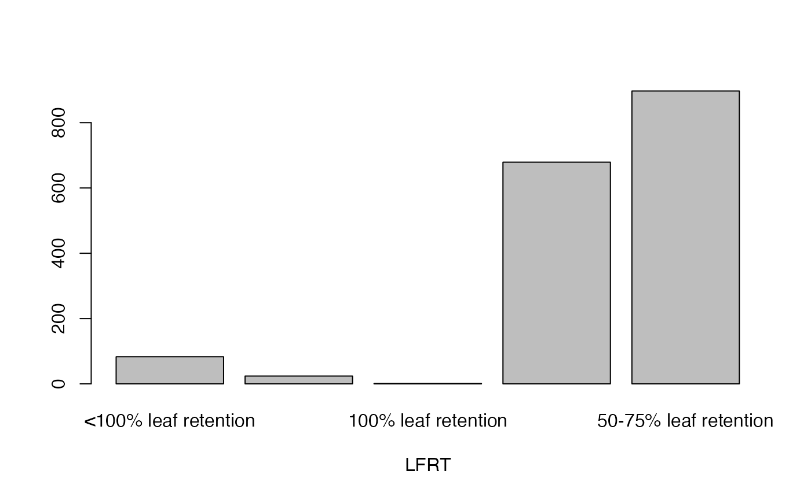
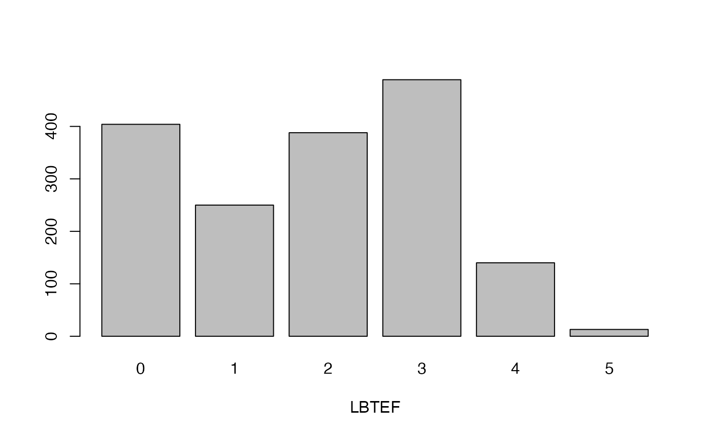
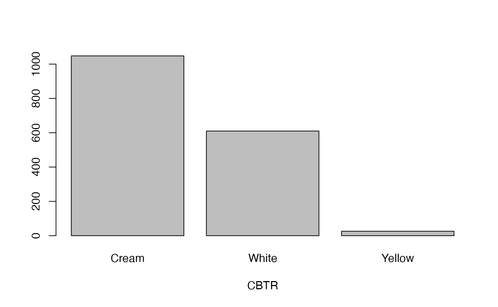
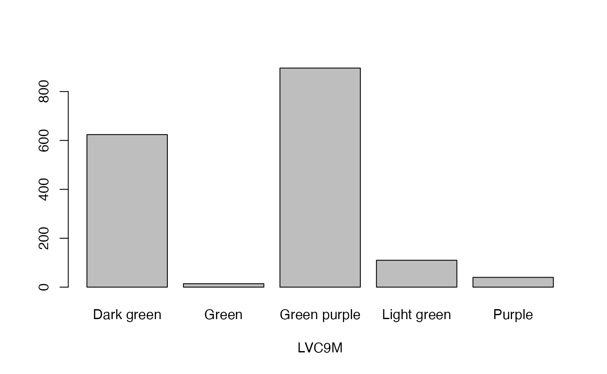
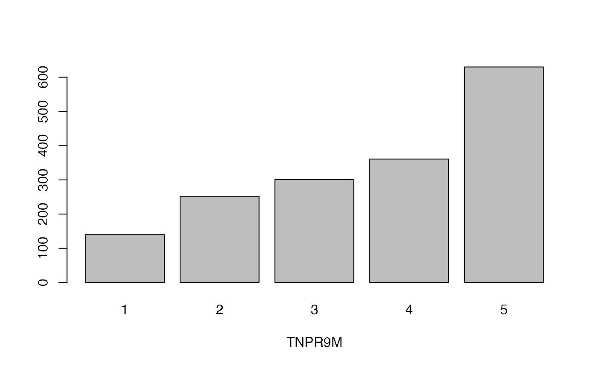
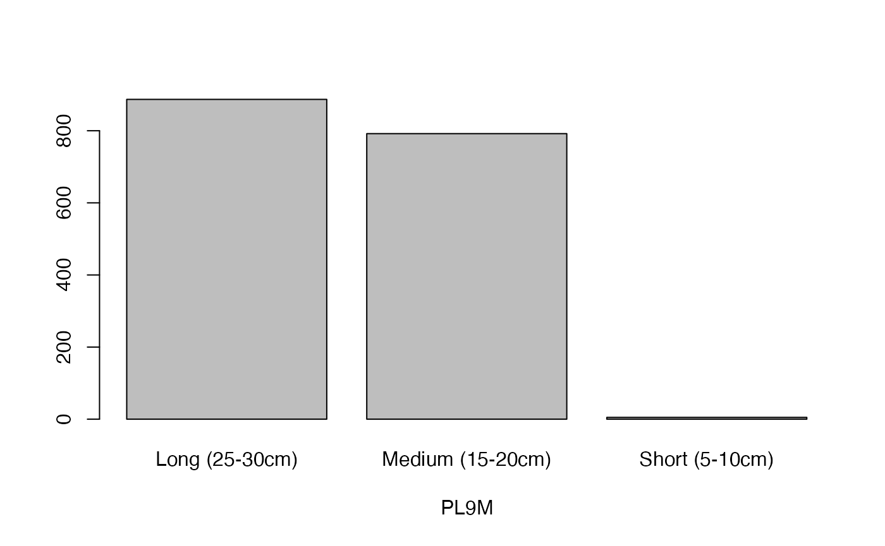

# Example Datasets in \`EvaluateCore\`

ICAR-National Bureau of Plant Genetic Resources, New Delhi.

## Introduction

The example datasets `cassava_EC` and `cassava_CC` in `EvaluateCore` for
demonstrating various functions were generated using the following steps
from the source data ([International Institute of Tropical Agriculture
et al.,
2019](#ref-international_institute_of_tropical_agriculture_cassava_2019)).

## Setup the environment

``` r
# Increase rJava memory allocation
options(java.parameters = "-Xmx8G")
rJava::J("java.lang.Runtime")$getRuntime()$maxMemory() / (1024^3)
```

``` r
# Load required packages
library(readxl)
library(corehunter)
```

    ## Loading required package: rJava

## Load and prepare data

``` r
# Load the raw data
# Source : https://www.genesys-pgr.org/datasets/929a273d-7882-43eb-8b1a-86032cbeb892
cassava_EC <- read_excel("IITA-Cassava collection-Cassava characterization dataset.xls")

sel <- c("Accession name",
         "Colour of unexpanded apical leaves",
         "Length of stipules", 
         "Petiole colour", "Distribution of anthocyanin",
         "Leaf retention", 
         "Level of branching at the end of flowering",
         "Colour of boiled tuberous root",
         "Number of levels of branching",
         "Angle of branching",
         "Colours of unexpanded apical leaves at 9 months", 
         "Leaf vein colour at 9 months",
         "Total number of plants remaining per accession at 9 months", 
         "Petiole length at 9 months",
         "Storage root peduncle",
         "Storage root constrictions",
         "Position of root", "Number of storage root per plant",
         "Total root number per plant",
         "Total fresh weight of storage root per plant",
         "Total root weight per plant",
         "Total fresh weight of storage shoot per plant",
         "Total shoot weight per plant",
         "Total plant weight",
         "Average plant weight",
         "Amount of rotted storage root per plant", 
         "Storage root dry matter")

cassava_EC <- cassava_EC[, sel]

str(cassava_EC)
```

    ## tibble [2,170 × 27] (S3: tbl_df/tbl/data.frame)
    ##  $ Accession name                                            : chr [1:2170] "TMe-1915" "TMe-1" "TMe-2" "TMe-3" ...
    ##  $ Colour of unexpanded apical leaves                        : chr [1:2170] "Dark green" "Light green" "Light green" "Dark green" ...
    ##  $ Length of stipules                                        : chr [1:2170] "Medium" "Short" "Long" "Medium" ...
    ##  $ Petiole colour                                            : chr [1:2170] "Green purple" "Purple" "Green purple" "Purple" ...
    ##  $ Distribution of anthocyanin                               : chr [1:2170] "Central part" "Totally pigmented" "Central part" "Totally pigmented" ...
    ##  $ Leaf retention                                            : chr [1:2170] "50-75% leaf retention" "25-50% leaf retention" "50-75% leaf retention" "25-50% leaf retention" ...
    ##  $ Level of branching at the end of flowering                : chr [1:2170] "2" "0" "1" "0" ...
    ##  $ Colour of boiled tuberous root                            : chr [1:2170] "Cream" "White" "Cream" "Cream" ...
    ##  $ Number of levels of branching                             : num [1:2170] 4 0 0 0 0 0 3 1 0 0 ...
    ##  $ Angle of branching                                        : chr [1:2170] "750-900" "No branching" "No branching" "No branching" ...
    ##  $ Colours of unexpanded apical leaves at 9 months           : chr [1:2170] "Dark green" "Dark green" "Dark green" "Light green" ...
    ##  $ Leaf vein colour at 9 months                              : chr [1:2170] "Dark green" "Green purple" "Green purple" "Green purple" ...
    ##  $ Total number of plants remaining per accession at 9 months: num [1:2170] 2 5 5 4 5 4 3 2 1 3 ...
    ##  $ Petiole length at 9 months                                : chr [1:2170] "Medium (15-20cm)" "Medium (15-20cm)" "Long (25-30cm)" "Medium (15-20cm)" ...
    ##  $ Storage root peduncle                                     : chr [1:2170] "Short" NA "Intermediate" NA ...
    ##  $ Storage root constrictions                                : chr [1:2170] "Absent" NA "Absent" NA ...
    ##  $ Position of root                                          : chr [1:2170] "Tending toward horizontal" NA "Tending toward horizontal" NA ...
    ##  $ Number of storage root per plant                          : num [1:2170] 4 NA 12 2 10 8 5 6 9 9 ...
    ##  $ Total root number per plant                               : num [1:2170] 2 NA 3 2 2 ...
    ##  $ Total fresh weight of storage root per plant              : num [1:2170] 2 NA 5.8 NA 1.6 0.8 7.8 5.8 7 6.4 ...
    ##  $ Total root weight per plant                               : num [1:2170] 1 NA 1.45 NA 0.32 ...
    ##  $ Total fresh weight of storage shoot per plant             : num [1:2170] 4 4 4.2 0.4 0.4 0.2 7.2 5.4 10 10.2 ...
    ##  $ Total shoot weight per plant                              : num [1:2170] 2 4 1.05 0.4 0.08 ...
    ##  $ Total plant weight                                        : num [1:2170] 6 4 10 0.4 2 1 15 11.2 17 16.6 ...
    ##  $ Average plant weight                                      : num [1:2170] 3 4 2.5 0.4 0.4 ...
    ##  $ Amount of rotted storage root per plant                   : num [1:2170] 1 NA 2 2 8 7 0 1 0 0 ...
    ##  $ Storage root dry matter                                   : num [1:2170] 38.4 NA 28 NA 42.6 42.3 40 40 32 31.2 ...

``` r
# Convert tibble to data.frame
cassava_EC <- as.data.frame(cassava_EC)
```

``` r
# Find NAs in each field
na_status <- lapply(cassava_EC, function(x) table(is.na(x)))
na_status <- dplyr::bind_rows(na_status,.id = "Descriptor")

DT::datatable(na_status,
              options = list(scrollX = TRUE, paging=TRUE))
```

``` r
# Remove non informative fields
cassava_EC$ID <- NULL
cassava_EC$`Ploidy level` <- NULL
cassava_EC$`Severity of CAD` <- NULL
cassava_EC$Status <- NULL
cassava_EC$`Height of the first apical branch` <- NULL

# Filter accessions with all the trait data present
cassava_EC <- na.omit(cassava_EC)
```

## Prepare the descriptors

``` r
# Descriptors
descriptors <- data.frame(Descriptors = colnames(cassava_EC)[-1])
descriptors$Abbr <- gsub("of|at|per plant|per accession", "", descriptors$Descriptors)
descriptors$Abbr <- gsub("\\s+", " ", descriptors$Abbr)
descriptors$Abbr <- abbreviate(descriptors$Abbr)
descriptors$Abbr <- gsub("\\(", "", descriptors$Abbr)
descriptors$Abbr <- toupper(descriptors$Abbr)
descriptors$Type <- ""

descriptors[c(1:16),]$Type <- "Qualitative"
descriptors[c(17:26),]$Type <- "Quantitative"

DT::datatable(descriptors,
              options = list(scrollX = TRUE, paging=TRUE))
```

``` r
colnames(cassava_EC) <- c("Accession name", descriptors$Abbr)

qual <- descriptors[descriptors$Type == "Qualitative", ]$Abbr
quant <- descriptors[descriptors$Type == "Quantitative", ]$Abbr

# Convert qualitative traits to factor
cassava_EC[, qual] <- data.frame(apply(cassava_EC[qual], 2, as.factor))
```

## Plot qualitative traits

``` r
qual_plots <- lapply(seq_along(cassava_EC[, qual]),
       function(i) {
         barplot(table(cassava_EC[, qual][, i]),
                           xlab = names(cassava_EC[, qual])[i])
         })
```



## Plot quantitative traits

``` r
quant_plots <- lapply(seq_along(cassava_EC[, quant]),
       function(i) hist(table(cassava_EC[, quant][, i]),
                        xlab = names(cassava_EC[, quant])[i],
                        main = ""))
```


## Standardize quantitative data

``` r
# Standardize quantitative data as Z score
cassava_EC_org <- cassava_EC
cassava_EC[, quant] <- apply(cassava_EC[, quant], 2,
                             function(x) scale(x, center = TRUE, scale = TRUE))

# Check standardization
lapply(cassava_EC_org[, quant], function(x) sd(x))
```

    ## $NMSR
    ## [1] 7.686827
    ## 
    ## $TTRN
    ## [1] 1.910758
    ## 
    ## $TFWSR
    ## [1] 4.532722
    ## 
    ## $TTRW
    ## [1] 1.656973
    ## 
    ## $TFWSS
    ## [1] 5.892645
    ## 
    ## $TTSW
    ## [1] 2.00211
    ## 
    ## $TTPW
    ## [1] 9.787778
    ## 
    ## $AVPW
    ## [1] 3.363355
    ## 
    ## $ARSR
    ## [1] 2.254339
    ## 
    ## $SRDM
    ## [1] 5.032887

``` r
lapply(cassava_EC[, quant], function(x) sd(x))
```

    ## $NMSR
    ## [1] 1
    ## 
    ## $TTRN
    ## [1] 1
    ## 
    ## $TFWSR
    ## [1] 1
    ## 
    ## $TTRW
    ## [1] 1
    ## 
    ## $TFWSS
    ## [1] 1
    ## 
    ## $TTSW
    ## [1] 1
    ## 
    ## $TTPW
    ## [1] 1
    ## 
    ## $AVPW
    ## [1] 1
    ## 
    ## $ARSR
    ## [1] 1
    ## 
    ## $SRDM
    ## [1] 1

``` r
lapply(cassava_EC_org[, quant], function(x) round(mean(x)))
```

    ## $NMSR
    ## [1] 12
    ## 
    ## $TTRN
    ## [1] 4
    ## 
    ## $TFWSR
    ## [1] 5
    ## 
    ## $TTRW
    ## [1] 2
    ## 
    ## $TFWSS
    ## [1] 7
    ## 
    ## $TTSW
    ## [1] 2
    ## 
    ## $TTPW
    ## [1] 12
    ## 
    ## $AVPW
    ## [1] 4
    ## 
    ## $ARSR
    ## [1] 2
    ## 
    ## $SRDM
    ## [1] 38

``` r
lapply(cassava_EC[, quant], function(x) round(mean(x)))
```

    ## $NMSR
    ## [1] 0
    ## 
    ## $TTRN
    ## [1] 0
    ## 
    ## $TFWSR
    ## [1] 0
    ## 
    ## $TTRW
    ## [1] 0
    ## 
    ## $TFWSS
    ## [1] 0
    ## 
    ## $TTSW
    ## [1] 0
    ## 
    ## $TTPW
    ## [1] 0
    ## 
    ## $AVPW
    ## [1] 0
    ## 
    ## $ARSR
    ## [1] 0
    ## 
    ## $SRDM
    ## [1] 0

## Create CoreHunter phenotype data

``` r
# Row names as accession names
rownames(cassava_EC) <- cassava_EC$`Accession name`
rownames(cassava_EC_org) <- cassava_EC_org$`Accession name`

# Convert data to corehunter phenotypes format
# RD - for quantitative; NS - for qualitative
pheno <- phenotypes(data = cassava_EC[, -1],
                    types = ifelse(descriptors$Type == "Qualitative",
                                   "NS", "RD"))

pheno
```

    ## # Phenotypes
    ## 
    ## Number of accessions = 1684
    ## Ids: chr [1:1684] "TMe-1915" "TMe-2" "TMe-4" "TMe-6" "TMe-11" "TMe-12" "TMe-13" ...
    ## 
    ## Number of traits = 26
    ## Traits: "CUAL" "LNGS" "PTLC" "DSTA" "LFRT" "LBTEF" "CBTR" "NMLB" "ANGB" "CUAL9M" "LVC9M" "TNPR9M" "PL9M" "STRP" "STRC" "PSTR" "NMSR" "TTRN" "TFWSR" "TTRW" "TFWSS" "TTSW" "TTPW" "AVPW" "ARSR" "SRDM"
    ## Quantitative traits: "NMSR" "TTRN" "TFWSR" "TTRW" "TFWSS" "TTSW" "TTPW" "AVPW" "ARSR" "SRDM"
    ## Qualitative traits: "CUAL" "LNGS" "PTLC" "DSTA" "LFRT" "LBTEF" "CBTR" "NMLB" "ANGB" "CUAL9M" "LVC9M" "TNPR9M" "PL9M" "STRP" "STRC" "PSTR"

## Setup CoreHunter parameters

``` r
# Set seed for reproducible results
set.seed(123)

# Desired size
csize <- 0.1 # 10%

# Max search steps without improvement
impr_steps <- 100

# CoreHunter objectives
# Equal weightage for Average entry-to-nearest-entry distance (EN) and 
# Average accession-to-nearest-entry distance (AN)
obj <- list(
  objective(type = c("EN"), measure = c("GD")),
  objective(type = c("AN"), measure = c("GD")))

obj
```

    ## [[1]]
    ## Core Hunter objective: EN (measure = GD, weight = 1.00, range = N/A)
    ## [[2]]
    ## Core Hunter objective: AN (measure = GD, weight = 1.00, range = N/A)

## Generate the core

``` r
core <- sampleCore(data = pheno, obj = obj, size = csize,
                   impr.steps = impr_steps, verbose = TRUE)
```

    ## Normalizing objectives.
    ## Average entry to nearest entry (Gower): [0.167, 0.293]
    ## Average accession to nearest entry (Gower): [0.140, 0.188]
    ## Finished normalization.
    ## Search : ParallelTempering started
    ## Current value: -0.368442
    ## Current value: -0.358982
    ## Current value: -0.330855
    ## Current value: -0.294309
    ## Current value: -0.294106
    ## Current value: -0.276086
    ## Current value: -0.271618
    ## Current value: -0.260871
    ## Current value: -0.257898
    ## Current value: -0.250268
    ## .
    ## .
    ## .
    ## .
    ## .
    ## .
    ## .
    ## .
    ## .
    ## .
    ## Current value: 0.437049
    ## Current value: 0.437233
    ## Current value: 0.437836
    ## Current value: 0.438005
    ## Current value: 0.439092
    ## Current value: 0.440315
    ## Current value: 0.440388
    ## Current value: 0.441378
    ## Current value: 0.441550
    ## Search : ParallelTempering stopped after 908.0 seconds and 1493 steps
    ## Best solution with evaluation : 0.441550
    ## Best solution with evaluation : Subset solution: {44, 417, 585, 609, 990, 1064, 1085, 1155, 1347, 1353, 1362, 1408, 1422, 1462, 1515, 1616, 1640, 1670, 1530, 1517, 772, 204, 1481, 571, 533, 833, 1138, 826, 9, 75, 481, 605, 1203, 568, 1411, 579, 781, 428, 588, 1133, 1524, 1073, 842, 379, 1536, 1676, 710, 1378, 272, 87, 1156, 25, 767, 1661, 756, 822, 1201, 893, 1382, 1369, 1578, 1163, 1134, 1611, 1618, 1667, 476, 1019, 1421, 678, 1602, 802, 467, 559, 1641, 1087, 228, 1541, 508, 1500, 1014, 1233, 1529, 793, 932, 619, 942, 1673, 1683, 1537, 1380, 829, 1146, 1649, 168, 1383, 242, 1399, 864, 434, 224, 1273, 1680, 582, 1470, 1333, 1566, 1127, 1015, 690, 1128, 927, 1672, 1581, 213, 718, 31, 1337, 1227, 661, 1151, 171, 606, 563, 347, 186, 925, 763, 465, 969, 124, 1437, 1594, 459, 305, 817, 818, 681, 876, 1270, 551, 93, 263, 1453, 246, 1331, 1181, 873, 1302, 1290, 1596, 697, 1164, 1660, 130, 1538, 1044, 635, 386, 192, 1469, 600, 1017, 894, 682, 594, 453, 1174}

    ## $sel
    ##   [1] "TMe-38"   "TMe-41"   "TMe-66"   "TMe-72"   "TMe-123"  "TMe-150" 
    ##   [7] "TMe-180"  "TMe-181"  "TMe-206"  "TMe-241"  "TMe-247"  "TMe-264" 
    ##  [13] "TMe-287"  "TMe-353"  "TMe-378"  "TMe-386"  "TMe-436"  "TMe-447" 
    ##  [19] "TMe-486"  "TMe-540"  "TMe-550"  "TMe-589"  "TMe-603"  "TMe-634" 
    ##  [25] "TMe-667"  "TMe-696"  "TMe-698"  "TMe-700"  "TMe-706"  "TMe-725" 
    ##  [31] "TMe-764"  "TMe-766"  "TMe-778"  "TMe-815"  "TMe-828"  "TMe-835" 
    ##  [37] "TMe-858"  "TMe-886"  "TMe-888"  "TMe-919"  "TMe-945"  "TMe-1086"
    ##  [43] "TMe-1091" "TMe-1117" "TMe-1124" "TMe-1137" "TMe-1139" "TMe-1174"
    ##  [49] "TMe-1188" "TMe-1211" "TMe-1216" "TMe-1232" "TMe-1234" "TMe-1271"
    ##  [55] "TMe-1290" "TMe-1297" "TMe-1336" "TMe-1377" "TMe-1390" "TMe-1404"
    ##  [61] "TMe-1484" "TMe-1512" "TMe-1526" "TMe-1541" "TMe-1564" "TMe-1730"
    ##  [67] "TMe-1733" "TMe-1744" "TMe-1775" "TMe-1795" "TMe-1804" "TMe-1823"
    ##  [73] "TMe-1836" "TMe-1901" "TMe-1960" "TMe-2003" "TMe-2010" "TMe-2027"
    ##  [79] "TMe-2033" "TMe-2043" "TMe-2050" "TMe-2064" "TMe-2069" "TMe-2084"
    ##  [85] "TMe-2103" "TMe-2128" "TMe-2158" "TMe-2172" "TMe-2191" "TMe-2196"
    ##  [91] "TMe-2240" "TMe-2326" "TMe-2372" "TMe-2543" "TMe-2551" "TMe-2568"
    ##  [97] "TMe-2643" "TMe-2775" "TMe-2785" "TMe-2791" "TMe-2797" "TMe-2820"
    ## [103] "TMe-2853" "TMe-2904" "TMe-2913" "TMe-2934" "TMe-2935" "TMe-2940"
    ## [109] "TMe-2952" "TMe-2967" "TMe-2975" "TMe-2980" "TMe-2984" "TMe-2989"
    ## [115] "TMe-2993" "TMe-3044" "TMe-3076" "TMe-3109" "TMe-3110" "TMe-3115"
    ## [121] "TMe-3141" "TMe-3151" "TMe-3163" "TMe-3164" "TMe-3185" "TMe-3210"
    ## [127] "TMe-3233" "TMe-3252" "TMe-3262" "TMe-3276" "TMe-3292" "TMe-3296"
    ## [133] "TMe-3302" "TMe-3324" "TMe-3329" "TMe-3378" "TMe-3396" "TMe-3411"
    ## [139] "TMe-3415" "TMe-3424" "TMe-3434" "TMe-3437" "TMe-3452" "TMe-3454"
    ## [145] "TMe-3455" "TMe-3457" "TMe-3460" "TMe-3466" "TMe-3475" "TMe-3481"
    ## [151] "TMe-3493" "TMe-3545" "TMe-3548" "TMe-3549" "TMe-3573" "TMe-3577"
    ## [157] "TMe-3581" "TMe-3591" "TMe-3601" "TMe-3605" "TMe-3628" "TMe-3638"
    ## [163] "TMe-3667" "TMe-3690" "TMe-3721" "TMe-3730" "TMe-3731" "TMe-3736"
    ## 
    ## $EN
    ## $EN$GD
    ## [1] 0.2592901
    ## 
    ## 
    ## $AN
    ## $AN$GD
    ## [1] 0.1537492
    ## 
    ## 
    ## attr(,"class")
    ## [1] "chcore" "list"

## Export the datasets

``` r
cassava_CC <- cassava_EC_org[rownames(cassava_EC) %in% core$sel, ]

write.csv(cassava_EC_org, "cassava_EC.csv", row.names = TRUE)
write.csv(cassava_CC, "cassava_CC.csv", row.names = TRUE)
```

## Session Info

``` r
sessionInfo()
```

    ## R version 4.5.2 (2025-10-31)
    ## Platform: aarch64-apple-darwin20
    ## Running under: macOS Sequoia 15.7.3
    ## 
    ## Matrix products: default
    ## BLAS:   /System/Library/Frameworks/Accelerate.framework/Versions/A/Frameworks/vecLib.framework/Versions/A/libBLAS.dylib 
    ## LAPACK: /Library/Frameworks/R.framework/Versions/4.5-arm64/Resources/lib/libRlapack.dylib;  LAPACK version 3.12.1
    ## 
    ## locale:
    ## [1] en_US.UTF-8/en_US.UTF-8/en_US.UTF-8/C/en_US.UTF-8/en_US.UTF-8
    ## 
    ## time zone: UTC
    ## tzcode source: internal
    ## 
    ## attached base packages:
    ## [1] stats     graphics  grDevices utils     datasets  methods   base     
    ## 
    ## other attached packages:
    ## [1] corehunter_3.2.3 rJava_1.0-11     readxl_1.4.5    
    ## 
    ## loaded via a namespace (and not attached):
    ##  [1] vctrs_0.7.0        cli_3.6.5          knitr_1.51         rlang_1.1.7       
    ##  [5] xfun_0.56          otel_0.2.0         generics_0.1.4     textshaping_1.0.4 
    ##  [9] jsonlite_2.0.0     glue_1.8.0         DT_0.34.0          htmltools_0.5.9   
    ## [13] ragg_1.5.0         sass_0.4.10        rmarkdown_2.30     cellranger_1.1.0  
    ## [17] crosstalk_1.2.2    tibble_3.3.1       evaluate_1.0.5     jquerylib_0.1.4   
    ## [21] fastmap_1.2.0      naturalsort_0.1.3  yaml_2.3.12        lifecycle_1.0.5   
    ## [25] compiler_4.5.2     dplyr_1.1.4        fs_1.6.6           pkgconfig_2.0.3   
    ## [29] htmlwidgets_1.6.4  systemfonts_1.3.1  digest_0.6.39      R6_2.6.1          
    ## [33] tidyselect_1.2.1   pillar_1.11.1      magrittr_2.0.4     bslib_0.9.0       
    ## [37] tools_4.5.2        pkgdown_2.2.0.9000 cachem_1.1.0       desc_1.4.3

## References

International Institute of Tropical Agriculture, Benjamin, F., and
Marimagne, T. (2019). Cassava morphological characterization. Version
2018.1. Available at:
<https://www.genesys-pgr.org/datasets/929a273d-7882-43eb-8b1a-86032cbeb892>
\[Accessed June 7, 2022\].
